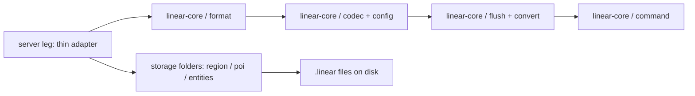
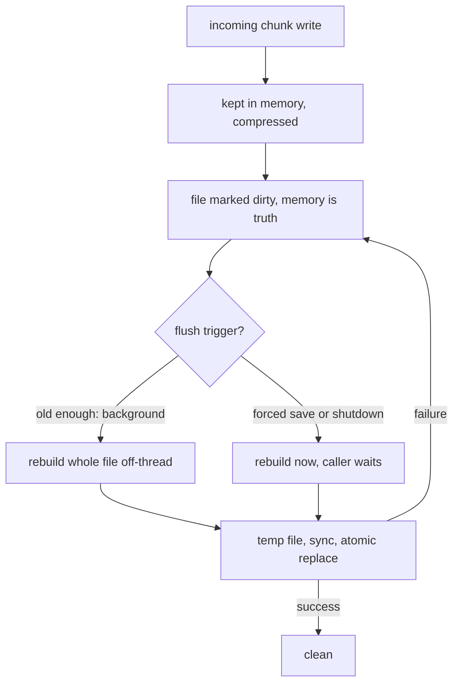

# Architecture

How Linear stores chunks, when bytes reach disk, and how the shared core relates to each server leg.

## Overview

Each game server is served by a small adapter that delegates inward to one shared storage core. The core owns the format and all policy. Adapters never own storage logic, and the core never calls outward into server code.

Core layers build in one direction only: description of the file layout first, then compression and settings, then background writing and conversion, then operator commands last.

Every world has three storage folders — region, poi, and entities — and each folder gets its own write coordinator. All coordinators share one server-wide worker pool.

## On-disk format

One region file holds a 32 by 32 square of chunks, 1024 slots in total.

- Every file opens with a fixed magic number header and closes with the same magic number as a footer, so torn or truncated files are easy to reject. The magic value is C3FF13183CCA9D9A in both places.
- Files are written as version 2. Readers accept versions 1 and 2, so old files keep loading after an upgrade.
- The body is a single compressed blob holding two things in order: a table of 1024 size-and-timestamp pairs, then the raw chunk payloads concatenated in slot order. An empty slot simply means that chunk is absent.
- Chunk payloads are opaque: whatever the game hands to storage comes back unchanged on read.
- There are no sidecar files — no `.mcc` files or anything like them. A single chunk larger than 500 megabytes is rejected rather than spilled elsewhere, matching the bound the vanilla game uses.
- The header carries a compression-level byte for diagnostics only. Readers ignore it, so changing the level is a settings change rather than a format change.

## Write path

Writes are memory-only first. The durable file rewrite happens later, at flush time.

1. The incoming chunk payload is copied and compressed in memory, outside any lock.
2. Under a short lock the slot reference is swapped and the file is marked dirty. The in-memory copy is now the truth.
3. The storage layer reports the dirty file to the folder coordinator.
4. At flush time the file snapshots its tables and clears the dirty mark under lock, then — unlocked — rebuilds the entire region as one compressed stream and replaces the file on disk.
5. The replacement is a temp file followed by a sync to disk followed by an atomic rename, so a crash leaves either the old file or the new file, never a half file.

A write that races a flush is safe: it either lands in the snapshot being written, or it re-marks the file dirty and is picked up by the next flush. No acknowledged write is lost.

## Flush coordination

One coordinator per storage folder, one shared pool for the whole server.

- The dirty set per coordinator is bounded at 512 files. Duplicates coalesce, so repeated writes to the same file do not grow the set.
- Flushing is age-gated: routine saves only write files whose oldest dirty mark is older than the flush interval, which defaults to 10 seconds. Young files wait.
- When the bound is exceeded, the oldest file drains in the background without blocking the game thread, keeping memory bounded while gameplay continues.
- Background drains never block the caller. The caller continues immediately once the work is handed off.
- Forced saves and shutdown behave differently: they flush everything regardless of age and wait for all work to finish, giving a zero-loss stop as long as the flushes finish inside the shutdown settle window (about 30 seconds). At unsafe compression levels they may not finish in time — see limitations.
- Background work runs on a single shared worker pool for the whole server, so a multi-second file rewrite never stalls the game thread. The crash window is unchanged by this: up to one flush interval of edits can still be lost on a force-kill.
- Unloading a world flushes whatever is still dirty for that folder and drops the coordinator registration, so worlds do not leak coordinators over time.

## Reading and coexistence

- Reads work in dual mode: storage looks for the old-style file first, then the Linear file, and opens whichever exists.
- The lookup runs regardless of the configured format, so flipping the format setting in either direction is safe.
- Miss caching is extension-aware, so a miss on one extension does not hide a file with the other extension.
- The format setting only decides what newly created files look like. It never blocks reading the other kind.
- Upgrade and recreate scans see both file kinds, so world conversion tools find every region.

## Server legs

Server legs under `versions/servers` are thin patches over the game. They adapt chunk I/O seams, configuration, commands, and conversion triggers, then delegate inward to `linear-core`.

- There is a single mapping point from world configuration to storage format, shared by all call sites, so there is one place to look when formats disagree.
- The game keeps its per-write flush behaviour for the old format. Only Linear defers durability to the coordinator.
- Common hunks shared byte-for-byte across servers live once under `versions/servers/26.1.x/common`. Near-identical hunks with mapping drift stay per server as thin adapters.
- Direction of dependence is always inward: legs call the core, never the reverse. That is what keeps ports and rebases small.

## Concurrency rules

- Each file is guarded by short locks that are never held while doing disk or compression work, so flushes of different files never block each other.
- There is one shared, bounded worker pool for the whole server — no thread per file, no pool per folder.
- Memory-heavy paths reuse direct buffers end to end instead of allocating on every flush, keeping garbage-collection pauses down on busy servers.
- Save statistics use lock-free counters only, so measuring never slows saving.
